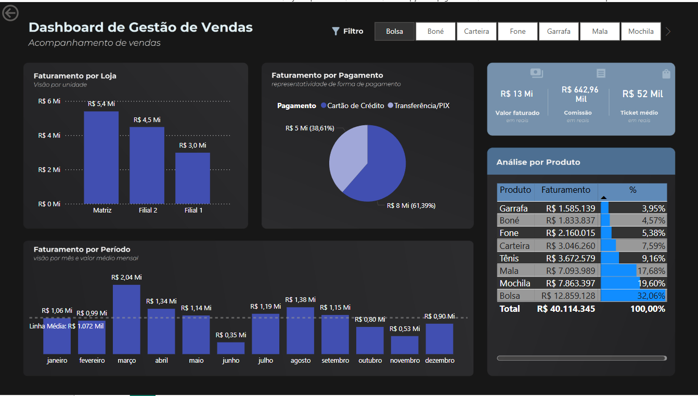

# 📊 Gerenciamento de Vendas - Power BI Dashboard

Bem-vindo ao repositório do projeto **Gerenciamento de Vendas**, uma aplicação de Business Intelligence desenvolvida em **Power BI** que transforma dados brutos de vendas em insights acionáveis. Este projeto foi idealizado com foco em tomada de decisão estratégica para redes varejistas.

---

## 📁 Base de Dados (`bd_vendas.xlsx`)

A base de dados é composta por duas planilhas principais:

### 1. `registroVendas`
Contém o histórico detalhado de pedidos realizados em diferentes lojas:

| Coluna           | Descrição                                        |
|------------------|--------------------------------------------------|
| ID Pedido        | Identificador único do pedido                    |
| Data Pedido      | Data em que o pedido foi realizado               |
| Código Loja      | Código da loja onde o pedido foi efetuado        |
| Produto          | Nome do produto vendido                          |
| Qtde/Preco Unit  | Quantidade vendida e preço unitário (formato: qtde/preço) |
| Pagamento        | Forma de pagamento utilizada                     |

### 2. `lojas`
Tabela auxiliar com as informações das unidades de venda:

| Coluna        | Descrição                    |
|---------------|------------------------------|
| codigo_loja   | Código de identificação da loja |
| nome_loja     | Nome da unidade (ex: Matriz) |
| Cidade        | Localização da loja          |
| UF            | Estado                       |

---

## 📈 Dashboard - Power BI (`GerenciamentoDeVendas.pbix`)

O dashboard foi desenvolvido com foco em usabilidade, performance e clareza visual. Ele oferece:

- **Visão Geral de Vendas**: Total vendido, número de pedidos, ticket médio.
- **Análise por Loja**: Comparativo entre unidades, performance por região.
- **Análise de Produtos**: Produtos mais vendidos e mais lucrativos.
- **Meios de Pagamento**: Participação de cada método nas vendas totais.
- **Filtro por Período**: Selecione datas específicas para análise sazonal.

---

## 🖼️ Prints do Dashboard

